<h2>Interactive Website Development</h2>
This is the readme.md file for my website that has been created for the interactive website development module. This game that I have created is to try and use my knowledge of JS, CSS and HTML to create a simple but yet effective series of memory games. My idea was to create a game that contained a way of rewarding the player no matter what, but their reward value would improve depending on how well they complete each of the mini-games.

My website can be accessed on the GitHub cloud at this address: <a href="https://roy-finch.github.io/interactive-web-page/"> Online Webpage</a>.
My wireframe can be located at this address: <a href="https://miro.com/app/board/o9J_lVBKfRY=/"> Wireframe</a>

<h3>Index</h3>
This is my index for easy navigation around my readme.md file. This is to help the user be able to find out the information on which they may need.

I <a href="#1">Introduction</a> 
II <a href="#2">Initial Idea</a> 
III <a href="#3">Development</a> 
IV <a href="#4">Deployment</a> 
V <a href="#5">Testing</a> 
VI <a href="#6">User Experiences</a> 
VII <a href="#7">Screenshots of the Final Game</a> 
VIII <a href="#8">Updating</a> 
IX <a href="#9">Bibliography</a> 

<h3 id="1">Introduction</h3>
Initially I wanted to create a game on which would present the user with a series of different memory games, I didn't want to create a simple game with one mechanic and only be able to test the player in one way. I also wanted to try and create the game using only JS, CSS and HTML. I wanted to try and keep the website on which holds the game simple and yet effective so that it may be able to be resized and changed depending on what the user would like to do. The functionality and simplicity of the two webpages make them very versatile.

I wanted to create a game that had the ability to inform the player on how to complete the different mini-games but, I had realized that text when created on a canvas can behave in a series of strange and interesting ways to. I chose to go back to my original idea and use an external text box for the Guide to use to talk to the player.

Originally, I had wanted to make the game, all in one and try and create a series of assets by hand, but I liked the idea of a website that generates and creates the visuals using the canvas. getContent command and the 2D rendering graphics. I also wanted to try and create a series of functions within my game that can be changed massively, which would allow for functions like the world gen, to be able to create a series of worlds depending on the user's choice.

One of the current things I am trying to create and implements is for some visual things to be generated on the canvas whilst the player is in the menu screen. Originally, I wanted to hide the canvas and display it when the user would like to play a game that required visuals. Due to the issues that were created from hiding the canvas, I choice to leave the canvas always visible and will fill the empty space with some idle imagery. I want to make sure that the mini-games are on a higher priority than the actual extra content. Like producing some sort of visual fill-in. This is a feature that could help with stimulating the user's attention but I prefer to make sure that the games work to the extent on which I want, before doing the extra content.

My idea was to create a game on which the user can be rewarded from. In this game depending on how well the user completes a sequence of mini-games. Depending on how well they are rewarded. If they incorrectly place a marker in the wrong location, they would be rewarded with biome-dependent items like stone, dirt, sand and wood. If they are to complete the minigames to a good standard they would be able to receive better products. The idea was to have the items presented to the user in a museum when completed. But I thought of create another mini-game in there where you can recover the items you find. Once recovered they would be stored in the museum as a record of how the user has done and how well they have managed to complete the mini-game sequence. Some form of scoring system will be placed on each item. Maybe a percentage of how well the item is, will be the way it is presented. This would be a mean of how well the user has done during the different mini-games.

<h3 id="2">Initial Idea</h3>
My initial idea was to try and create a game that had some form of terrain, which would be generated randomly. This would mean that the functions to call out terrain generation and rendering would have to be versatile. I would then be able to create the different biomes within the game. Originally, I wanted to make the difficulty increase over time, but instead I want to make the game become more difficult when the user successfully completes a full mini-game. I may create an average of how well the user performs and from these statistics make the game demanding on the user but custom to how well they can complete the mini-games. I want to make the game able to become hard but not impossible. I want to try and present the user with a challenge that is equal to how well they can complete the game.

The way on which the game would judge difficulty is through how accurate and how quick the user is. I will use the percentage of how accurate the user is to give them bonus time on the scan. This would be to allow the user to have bonus time if they are very inaccurate but if they succeed with the 2 second scan time, I may decrease it. Then also I will try and create some form of time boundaries for the user. If they are quick or slow then create an understanding of how fast they are. Maybe creating a mean value of the users time, they take and how accurate they are overall.

I am trying to implement a function on which the user is able to select any location and after selecting the number of locations given to the user, then I would begin a second mini-game this would a quick timed, sequence event. I will try and make the text command produce a sequence that the user will have to repeat. This type of mini-game will be used twice. One within this instance and another when the user is in the museum trying to recover an item that they have unearthed.

I have created a plan of my idea on a wireframe to be able to see a general theme and functionality of the game, I wanted to make the theme game focused. I generally stuck to the idea of the theme that I had listed on the wireframe I had just changed a few features later on in the game, as the canvas and text file felt separated and behaved weirdly when the webpage is small. I had thought of including the text file with the canvas inside it so that the two elements are grouped together. I like how it feels now as the canvas feels as though it doesn't always have to be grab the players attention.

<h3 id="3">Development</h3>
Whilst programming the website I want to make it able to be accessed from a series of devices. I would like to try and create a game with a fundamental premise, but be able to be played by many different people. Some of the functions on which I have created may be seen as very overly complicated but I want to be able to generate a series of noticeable differences within terrain and within the mini-game so that the user can notice the differences and notice some form of progression. I am going to try and place a series of requirements on different levels and biome types so that the user would have a series of goals. What I may do is some form of achievement system or a goal so that there is a guidance or way for the user to understand what to do.

Within this game I would like to make the controls basic but yet effective. I am trying to focus the development for just PC and at a later point, if possible, begin to adapt the controls for other devices. I want to be able to produce a game that can give the user some forms of responses. I have chosen create an introduction for the user to be able to understand the functionality of the different keys that are being used. At some point I would like to fill in the canvas in different instances to make sure that it's not a blank canvas. This can be done in several ways. I would like to create some form of visual representation of what the user is hovering over or going to select. This could be in a form some sort of imagery based on the idea that the text holds. I would like to create some sort of backpack, to represent the inventory, and other examples being a map or some sort of scroll. This would present more to the user and I feel as though this would make the user more interested within the game.

When creating the website shell which holds the game, I went for a type of theme that would generally go well with the whole idea of digging. The idea was always some form of dig up game but then I tried to develop the idea further so that the user has more to work with.

The function for the biome will take parameters that will permit and generate different types of terrain. I wanted a dynamic renderer and generation function to create an array value and to present the values within the arrays. Originally, I actually wanted to use some sort of function that may be provided to generate the terrain but instead I chose to make my own algorithm. My terrain generating algorithm begins to understand its parameters which are just a gradient, and value restraints and how big the terrain actual is. With this function I am able to generate a light value that would be then placed into a hsl color callout to generate a different type of color or gradient. Along with this the algorithm assigns the values by looking to adjacent cells that are next to the cell that is being adjusted. Randomly, a gradient is applied which can either be positive, neutral or negative and from this then that is applied to the selected cell and the adjacent ones. This allows for me to create a very simple but effect difference within the terrain which can be seen by the user. I originally wanted to make the terrain become bigger as the game progressed but I found that this would begin to over complicate matters. So, I chose to create a piece of terrain and tiles that are consistent in size. The idea of creating functions that can be adapted allows for me to customize the terrain and try and produce a series of terrain and biome types. Effectively, the value could be seen as a form of a y axis. This would mean that the value would present a lighter color depending on its altitude.

I would also like to create a recovery mini-game with a sequence of key presses. This would be a fun way of presenting to the user how effective they were at obtaining items from the terrain. I want to create a percentage score on each geode or fossils to present how well they have been recovered. Within this instance I would be able to show how well they have done with obtaining and collecting these items.

In the website I have tried to create a very simple but effective website. This means that my main idea was to focus on the functionality of the webpage instead. I wanted to make sure that a portray a theme and style to user but don't over fill and over complicate the webpage. I want a website that would hold the game and the game would be able to be presented to the user. I wanted to make sure that the game and webpage are all in the screens view and try and make everything fit within the screen without creating an overflow.

I keep messing around with the style of the website. I thought that the version before this worked better but this feels and looks like a game. It just never felt as though the text and the canvas where in some form of relevant layout but now it feels as though the canvas is part of the game. I choice to make the canvas move just to allow for an overflow on the text box cause your items that you obtain can really fill the text box.  Now with the new layout change I feel as though an empty canvas doesn't impact the game as the text shows that the user has a form of response.

I chose to create this game on GitHub to allow for me to have a history of different versions of the production of my game, also chose to do this to be able to use the inside features of GitHub to place the webpage on a cloud-server so that it can be access online. This will allow me to place the webpage on the cloud for the accessor. This allows for me to also test the website on a cloud based instance, to see how it behaves when on the web.

I want to create a game that meets its requirements, has been fleshed out and has a form of progression and can allow for the user to be able to progress through the game or get new and interesting differences in the game. The way on which I add a uniqueness to the game is by adding the ability to upgrade the scanner and find and locate new biomes that have different yields.

<h3 id="4">Deployment</h3>
I have made several changes to my CSS to make sure that the webpage is designed correctly and that the theme that I wanted is present within different sizes and scales. I want to make sure that the theme is unable to be affected by the scale or size of the webpage. I want to make sure that the theme is continuous and does not change depending on how the webpage is viewed. I want to make sure that the webpage keeps its true layout as this webpage is designed to have a use of a p tag and a canvas which must be kept within a set space as these are part of the game. I don't want to allow for the website to lose its theme. I have a footer that contains a help page as well which would be kept below the text and canvas. This allows for the user if they are confused to seek help on a different page. I feel as though my game is straight forward enough to not need the help page but some people may require extra help with the game. Also, along with that the game does have some features that are very specific. Biomes have set chances which vary depending on your biome type. This is able to help the player find and locate the items that they may want to find.

To create this webpage, I have used the GitPod editor software to be able to produce this game. I have used JS to program and create the functionality to my game. I wanted to make sure that there is a set response system. So that the guide is one of the main forms of response.

The theme on which I have chosen is able to give the user the exact theme that I was after but is not overly complicated so that the user can still focus on the game. Functionality was my main aim within this webpage and game I want to make sure that the whole game is worked out correctly and is able to be controlled the way on which I intended.

When creating the game idea, I needed to add a feature to the mini-games that makes the game progressively harder but also give the player an ability to actually be able to rebalance the game out. I wanted to give the user the ability to upgrade their items. I had chosen to add a tool belt as well which would hold the items on which the player uses whilst on their adventures. I wanted to also present the player with a form of progression and allow for them to be able to be given more items depending on how far they have gotten in the game. The idea is that the scanner can only reach so far and once upgraded you are able to reach further. Once upgraded you can adventure to biomes in different locations.

<h3 id="5">Testing</h3>
Within testing I have placed my JS code through the JSHint to find any mistakes on which I may have found whilst programming. I have spent time correcting a series of mistakes that were made, these vary from simple mistakes with declarations and semi-colons. This application can be found at <a href="https://jshint.com/">JSHint</a> and was used to help with the testing of the code.

Along with the use of this application, I have also spent several hours testing the game whilst playing to make sure that it works as it was programmed and intended to work. Once I have completed the programming I will test the game again and correct anything that doesn't work as intended.

When it comes with testing I tried and forced my game to originally break and fail and then working with these fails instead of bypassing these fails I chose to work around these fails reoccurring as well. I made several of my features able to handle extended inputs and makes sure that data types and other forms are correctly used and converted where needed. I wanted to see how many issues I can find with my code and force it to take extended forms of information. There are some functions created to help prevent these issues. I created a range function that takes a value, minimum and maximum and can make sure that numerical values are caught before they exceed the values they can possibly be. This is how I contain some of the data that is present on my game. One example where there are issues with numeric values exceeding was when you enter the second half of the digging mini-game. When generating a small section of terrain around the user's input, it used to crash the ctx renderer. Now the values can not exceed the value of the canvas. I have forced the user to use mouse inputs to initiate the getMouse function to allow for me to generate and create the values needed to understand the size of the canvas. The sizes of the canvas were used to control the user's responses and what is generated for the user. I wanted to make sure that the user cannot break the game and the game cannot misunderstand user inputs as this can ruin and effect a user's experience. Along with this I made sure that most of the data types are kept within a specific type and tried to make sure that the text print outs cannot incorrectly print the data that is required.

I have tried to keep the names of the variables and functions to a relevant name. I don't like over creating functions and variables and like to make sure that functions are all used within the code. I usually create several universal functions at the beginning of my code to help with data control and management, like the range feature. These features help with making sure that you keep your data types and values under control whilst coding.

I had chosen to create my text and canvas separatly cause at the beginning of the development I had found that text does not correctly render on the canvas with the style and font that I would like. I want text that is more understandable and easier to read as I myself need text to be clear and not overly complicated. I had also set my theme to keep consistent even on my help page as I like to make sure that my entire websites are created and all related with style and equal functionality. With the production of a webpage, I feel that it is relevant to make sure that the page doesn't draw the user's attention to other area or effects the users view in a negative fashion. Having a colored background was something I had tested at one point but realized that it was actual more beneficial to just leave it so that the text and canvas are mainly not affected by external properties.

I wanted to make sure that the text for the dialog box is exactly right. The style of the canvas and text box are my priority. I wanted to make sure that the text that is displayed is in a great and consistent theme and the text that is displayed doesn't overlap, clip or leave the text box. I wanted to also make sure that the text isn't overly scaled. I wanted to make sure that the name on the box is indented and bold to show to the user that it's more like a dialog box.

To deal with data that is either empty or invalid within some instances the user cannot perform a task as an if condition would prevent that or the game would deny a response that is invalid and empty. I have found several instances whilst programming where the game has had issues with handling invalid or empty information and I have now corrected or fixed those issues and errors.

<h3 id="6">Users Experiences</h3>
Whilst creating this concept I worked from the rules on which the course set for me which are to create a memory-based game, and create some form of response to the users. I had kept them as a focus when creating my idea. I wanted to also set a series of rules of myself. I wanted to create a game that would have a series of mini-games and also have a little more to the story. Along with these features I wanted to also make sure that the game did have a range of features which can alter the game as it may progress. I have changed the mechanics as the game progressed through development. I wanted to just do a few differences to make sure that the game felt the way on which I want it to feel.

I believe that the game meets all of these rules and requirements that I and the course have set and it feels really and works really well.

Along with my own experience of the game I also have asked for the opinion of a few friends to let me know what they think about my game.

When it comes to my experience of the game, I feel as though this meets everything that I was planning with this game. This game meets the rules that have been placed on my work and also gives the user a good experience when it comes to the mini-games. I feel as though the execution was great and that the game can display both responses and also display to the user how well they have done in the game. Also shows a form of progression and shows that the user has managed to get further in the game. This webpage has got great readability and allows for users with requirements to be able to read the font. Both font styles that I have selected have only got slight font styling.

Some of my friends have reviewed the style of the website. They said that they can see how the style works with the game and said that they enjoy the execution of the webpage. I can see that the controls are slightly difficult to use but beyond that the game has high functionality.

<h3 id="7">Screenshots of Final Game</h3>
Within this section I will include screen shots of the final game and explain how the game works and what I have tried to do to set the styles and functions within the game.

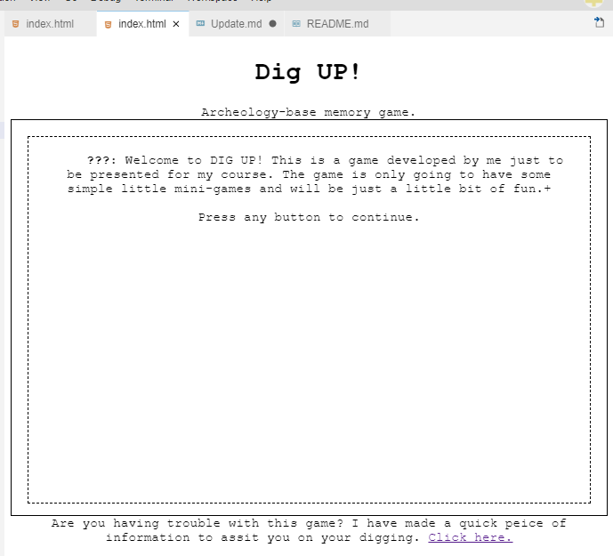
This is a screenshot of the DIGUP startup page, this is the screen that the user would see as soon as they access the webpage. The page has no overflow and is set to be scaled and themed respectfully. Recently to help with text overflow the canvas has been changed so that the border is now hidden. The text that is present is a welcome message to the user. The footer is a little bit of text that tells the user if they need help, there is a webpage link. The link is too a second, partially hidden webpage that opens a help.html file in a separate tab. This contains information about the game and gives the user a very watered-down guide about the game.

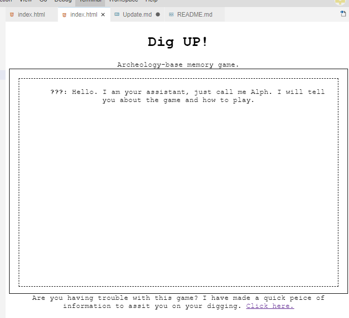
The theme and webpage stay the same. The text is a very simple hello my name is to introduce the user to a guide. I do this to make the webpage feel a little bit more personal. The guides name was Alph, I settled with this as I originally wanted to make his name an acronym for something weird or silly but settled on making the game simplified.

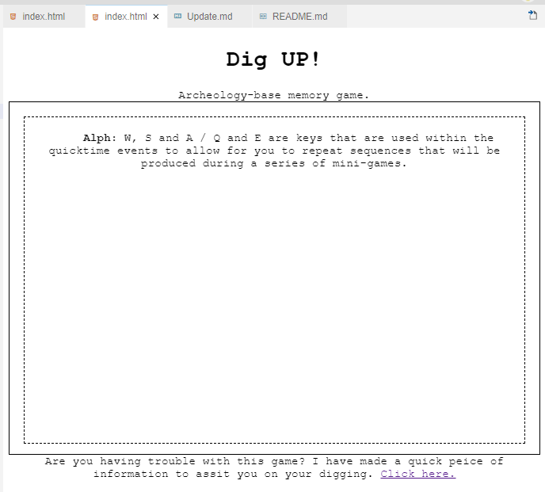
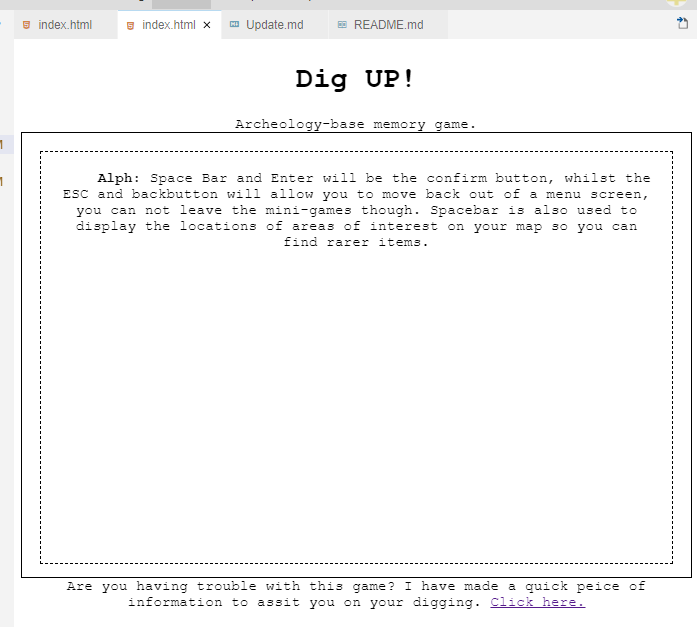
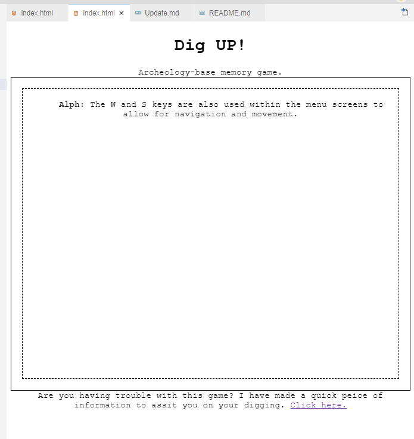
the text begins to change and allows for the user to navigate through the tutorial text.

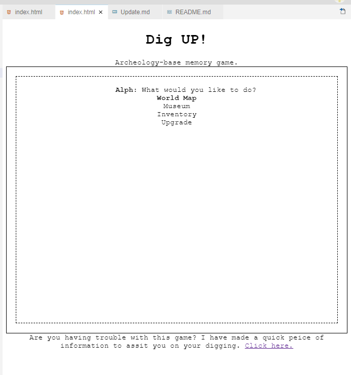
This is the main menu navigation and allows the user to be able to access the different features within the game. I wanted to allow the user to have a form of reward and progression and be able to control how hard the game can get. The game still progressively gets harder but the game does start to become easier if the user begins to alter the tool upgrades.

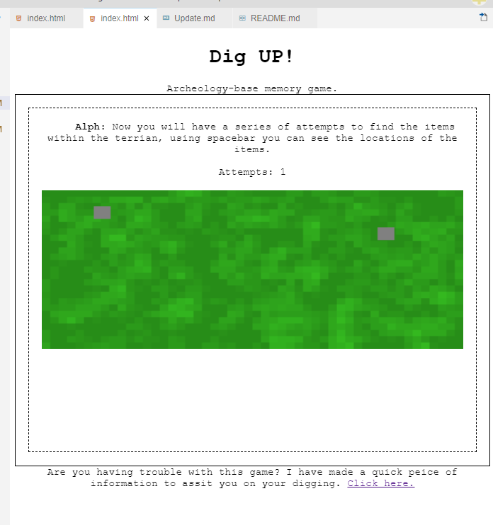
After starting the game, you are given a series of attempts, randomly 3-4 and you can press space to locate points of interest. Once you have found the points of interest you can place markers down. You don't have to place a marker on a point of interest. Once you have used all your attempts up you can now begin the second part of the mini-game.

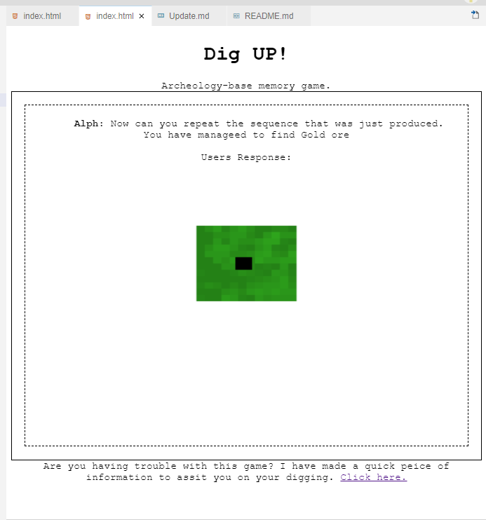
I have made it so that on the map you begin to see a section of the terrain where you have clicked which is isolated from the rest. I thought this was needed within the game to just fill in the canvas and give the user a response. I didn't want to overcomplicate it. I just used resources that I already had. Map was rendered and the dig attempts where present so I just displayed areas around the dig attempt.

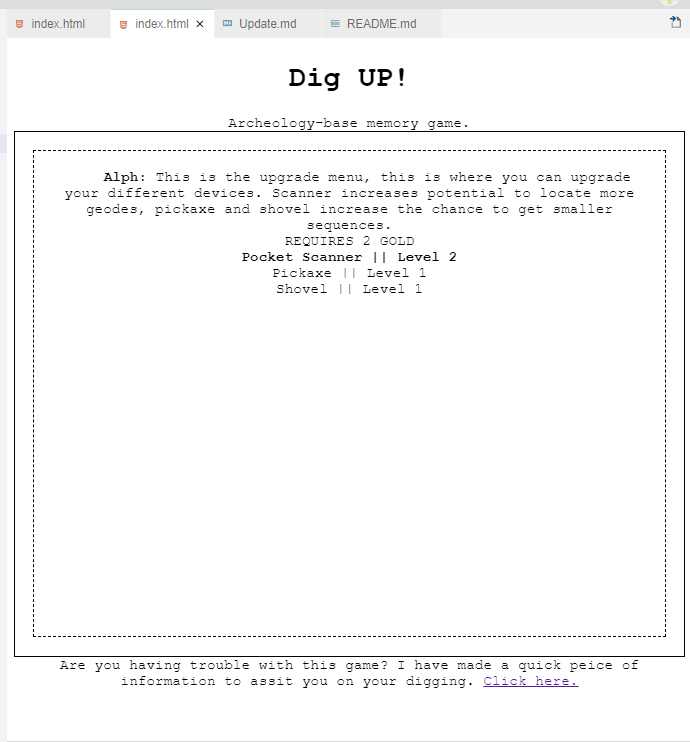
This is the upgrade screen and allows for the user to improve the tools that they are using during the mini-games. I wanted to allow them to unlock new and interesting biomes. Also, the tool upgrades allow for you to balance the game out.

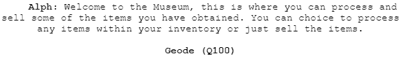
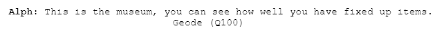
These two screenshots are from the museum mini-game, these are taken from when you choice an item to process and also after the item has been processed. When the item is chosen it will generate a sequence and once the sequence has been generated it will ask the user to repeat it. The Q feature to all items is a quality number on how well the user has salvaged and obtained an item. The game progressively gets harder so once they get into the game it is harder to obtain and recover items.

<h3 id="8">Updates</h3>
This section just links to the update log, this log is where I state changes on which I have made to the game and website. <a href="Update.md">Update Log</a>

<h3 id="9">Bibliography</h3>
These are the links on which I have used to find help on the JS language. 
<a href="https://www.w3schools.com/js/default.asp">W3Schools</a> - (https://www.w3schools.com/js/default.asp) I have used this webpage to be able to just enquire about issues and errors that I have had with my program and also used it to understand features of JS to be able to understand the differences. 
<a href="https://developer.mozilla.org/en-US/docs/Web/JavaScript/Reference/Global_Objects/undefined">MDN Web Docs</a> - (https://developer.mozilla.org/en-US/docs/Web/JavaScript/Reference/Global_Objects/undefined) - I have used this website to search for general information about JS just to understand how JS uses different functions and generally how to use JS. I have used several programming languages and just like to find the differences within the languages. 